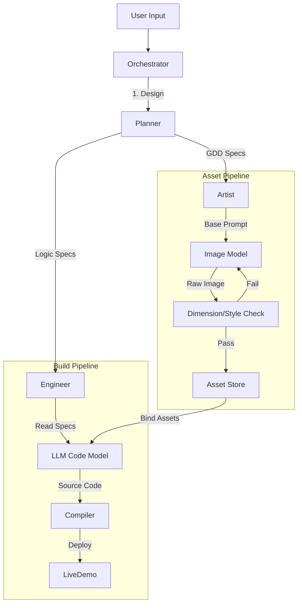

# Software Design Document (SDD): Trinity Agent Architecture

## 1. System Architecture

The system follows a **Multi-Agent Orchestration** pattern, where a central "Manager" coordinates specialized sub-agents.

### 1.1. Core Components
1.  **Orchestrator (The Manager)**
    *   **Role**: Manages the conversation state, task breakdown, and passing of context between agents.
    *   **Input**: User Prompts.
    *   **Output**: Task Directives.

2.  **Planner Agent**
    *   **Role**: Generates the Game Design Document (GDD) and Logic Rules.
    *   **Output**: JSON Configuration (e.g., `game_config.json` defining grid size, item types).

3.  **Artist Agent (Visual Gen)**
    *   **Role**: Text-to-Image generation using Stable Diffusion/Midjourney/DALL-E APIs.
    *   **Key Logic**:
        *   *Prompt Chaining*: Injects "Character Reference" embeddings into every prompt to ensure consistency.
        *   *Post-Processing*: Uses tools like `sips` or `ffmpeg` to crop/resize assets to strict requirements (e.g., 9:16).
        *   *Check-Refine Loop*: Self-corrects if output dimensions don't match specs (as seen in the V3 optimization flow).

4.  **Engineer Agent (Code Gen)**
    *   **Role**: Writes Game Logic (Scripts).
    *   **Input**: `game_config.json` + Asset Paths.
    *   **Output**: Source Code (TypeScript/React or C#/Unity) + Build Artifacts.

## 2. Data Flow

## 3. Technology Stack

*   **Frontend**: Next.js 14 (React) + Framer Motion (Simulation UI).
*   **Backend Agents**: Python (LangChain/AutoGPT) or Node.js (Vercel AI SDK).
*   **Image Generation**: Stable Diffusion XL / Midjourney API / DALL-E 3.
*   **Database**: Vector DB (for consistent style embeddings) + Local JSON Storage.

## 4. Implementation Strategy (The "Trinity" Flow)

1.  **Step 1**: **Visualization (V1/V2/V3)**. Prioritize visual feedback. Do not write code until the user approves the "Vibe".
2.  **Step 2**: **Asset Locking**. Once V3 is confirmed, freeze asset paths associated with the current `session_id`.
3.  **Step 3**: **Scaffolding**. Engineer Agent pulls a pre-built "Match-3 Template" and injects the locked V3 assets and config values.
4.  **Step 4**: **Deployment**. Hot-reload the preview iframe to show the actual game.
