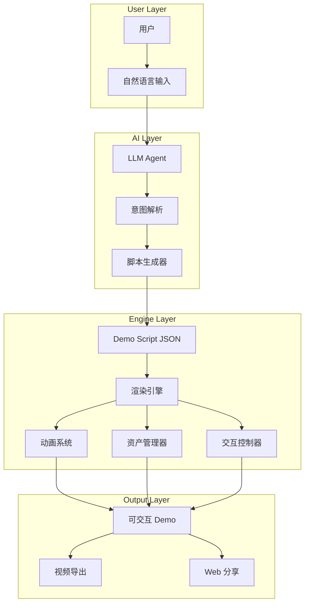

# 演示生成器 (Demo Generator) 综合设计报告

> **文档版本**: V1.0  
> **生成日期**: 2024-12-06  
> **基于项目**: Pitch-Demo-V1 (V3 Release)

---

## 1. 执行摘要

本报告基于 `ai-platform` 项目的开发实践，提炼出一套 **AI 驱动的演示生成器** 通用设计方案。该系统能够通过 **自然语言对话** 与 AI Agent 交互，利用 **Web 技术** 和 **数据驱动方法**，快速生成：

- 🎬 **演示视频** (Fake Demo Videos)
- 🖥️ **可交互 UI/UX 原型** (Interactive Prototypes)
- 📱 **应用概念演示** (App Concept Demos)

### 核心价值主张
| 维度 | 传统 PPT | Demo Generator |
|------|----------|----------------|
| **制作时间** | 数天 | 数小时 |
| **交互性** | 静态 | 全动态可交互 |
| **视觉冲击** | 平面 | 沉浸式动画 |
| **迭代成本** | 高 | 极低 (数据驱动) |
| **技术门槛** | 低 | 中 (但 AI 降低) |

---

## 2. 项目背景与开发实践总结

### 2.1 已实现功能 (V3)

基于 `SpatialCanvas.tsx` 和 `demo_script_v16.ts` 的实现：

```
用户输入 → Trend 分析 → 游戏概念 → Builder 序列 → 营销仪表盘
```

**技术栈验证**:
- **前端框架**: Next.js 16 (App Router)
- **动画引擎**: Framer Motion
- **样式系统**: TailwindCSS + CSS Variables
- **数据驱动**: JSON Script + TypeScript Types

**关键组件**:
| 组件 | 功能 | 实现方式 |
|------|------|----------|
| `SpatialCanvas` | 无限画布 + 相机系统 | `useMotionValue` + Transform |
| `TrendOverlay` | 市场分析可视化 | SVG + Motion Path |
| `PromptOverlay` | AI 输入模拟 | 打字机动画 |
| `IDEFrame` | 代码编辑器模拟 | 语法高亮 + 流式输出 |
| `MarketingDashboard` | 数据看板 | 动画柱状图 + 假数据回退 |
| `VideoFrame` | 视频生成模拟 | 进度条 + 扫描线效果 |

### 2.2 数据驱动架构

```typescript
// demo_script_v16.ts - 核心数据结构
interface DemoStep {
    id: string;
    title: string;
    description: string;
    zone: 'trend' | 'builder' | 'marketing';
    duration: number; // ms
    asset?: {
        type: 'image' | 'video' | 'code' | 'markdown' | 'dashboard';
        url: string;
        previewUrl?: string;
    };
    uiAction?: 'CODE_VIEW_OPEN' | 'MARKETING_VIEW_OPEN' | 'AUTO_PREVIEW';
}
```

**优势**: 修改 JSON 即可重构整个演示流程，无需改动代码逻辑。

---

## 3. 通用设计架构

### 3.1 系统架构图



### 3.2 核心模块设计

#### 3.2.1 AI 对话模块

```typescript
interface ConversationModule {
    // 意图识别
    parseIntent(input: string): DemoIntent;
    
    // 脚本生成
    generateScript(intent: DemoIntent): DemoScript;
    
    // 资产推荐
    suggestAssets(step: DemoStep): Asset[];
    
    // 迭代优化
    refineDemo(feedback: string, currentScript: DemoScript): DemoScript;
}

type DemoIntent = 
    | { type: 'product_demo', product: string }
    | { type: 'pitch_deck', startup: string }
    | { type: 'feature_walkthrough', features: string[] }
    | { type: 'game_concept', genre: string };
```

#### 3.2.2 渲染引擎模块

```typescript
interface RenderEngine {
    // 画布管理
    canvas: SpatialCanvas;
    
    // 相机控制
    camera: {
        panTo(zone: Zone): void;
        zoomTo(level: number): void;
        follow(node: Node): void;
    };
    
    // 节点系统
    nodes: NodeManager;
    
    // 连接线系统
    connections: ConnectionManager;
    
    // 覆盖层系统
    overlays: OverlayManager;
}
```

#### 3.2.3 资产生成模块

```typescript
interface AssetGenerator {
    // 图片生成 (集成 DALL-E / Midjourney / Imagen)
    generateImage(prompt: string): Promise<ImageAsset>;
    
    // 代码生成 (集成 Codex / Gemini)
    generateCode(spec: string): Promise<CodeAsset>;
    
    // 视频生成 (集成 VEO / Runway)
    generateVideo(prompt: string): Promise<VideoAsset>;
    
    // 文档生成
    generateDocument(template: string, data: object): Promise<DocAsset>;
    
    // Mock 数据生成
    generateMockData(schema: DataSchema): Promise<MockData>;
}
```

---

## 4. 技术实现要点

### 4.1 动画系统

**关键技术**: Framer Motion + CSS Animations

```typescript
// 曲线连接路径计算
function getCurvePath(x1: number, y1: number, x2: number, y2: number) {
    const dist = Math.abs(x2 - x1);
    const cp1x = x1 + dist * 0.5;
    const cp2x = x2 - dist * 0.5;
    return `M ${x1} ${y1} C ${cp1x} ${y1}, ${cp2x} ${y2}, ${x2} ${y2}`;
}

// SVG 路径动画
<motion.path 
    initial={{ pathLength: 0 }}
    animate={{ pathLength: 1 }}
    transition={{ duration: 1 }}
    d={getCurvePath(...)}
/>
```

### 4.2 流式输出模拟

```typescript
// 打字机效果
const streamText = (text: string, onUpdate: (t: string) => void) => {
    let i = 0;
    const interval = setInterval(() => {
        onUpdate(text.slice(0, i++));
        if (i > text.length) clearInterval(interval);
    }, 30);
};

// 代码流式显示
useEffect(() => {
    if (isStreaming) {
        streamText(code, setDisplayCode);
    }
}, [isStreaming, code]);
```

### 4.3 虚拟光标系统

```typescript
// 模拟用户交互
const runDemoSequence = async () => {
    for (const step of steps) {
        // 移动光标
        setCursorPos({ x: step.targetX, y: step.targetY });
        await delay(800);
        
        // 模拟点击
        setCursorClick(true);
        await delay(200);
        setCursorClick(false);
        
        // 触发内容
        setActiveContent(step.asset);
        await delay(step.duration);
    }
};
```

### 4.4 数据驱动渲染

```typescript
// 根据 asset type 动态渲染
const renderAsset = (asset: Asset) => {
    switch (asset.type) {
        case 'image':
            return <ImagePreview src={asset.url} />;
        case 'code':
            return <IDEFrame><SyntaxHighlight code={asset.content} /></IDEFrame>;
        case 'dashboard':
            return <MarketingDashboard dataUrl={asset.url} />;
        case 'video':
            return <VideoFrame url={asset.url} thumb={asset.previewUrl} />;
        default:
            return <DocFrame>{asset.content}</DocFrame>;
    }
};
```

### 4.5 假数据回退机制

```typescript
// 确保 UI 始终有内容显示
const FAKE_DATA = {
    project: "Demo Project",
    metrics: { impressions: 1000000, clicks: 45000 },
    daily_active_users: [
        { day: "Mon", users: 1200 },
        { day: "Tue", users: 1500 },
        // ...
    ]
};

const displayData = data || FAKE_DATA;
```

---

## 5. 商业价值分析

### 5.1 市场规模

| 市场 | 2024 规模 | 2029/2035 预测 | CAGR |
|------|-----------|----------------|------|
| AI 设计工具 | $5.5B | $15B (2029) | 22.2% |
| AI 设计工具 | $6.1B | $28.5B (2035) | 17.3% |
| AI 演示工具 | $0.8B | $4B (2030) | 25%+ |

> 数据来源: Future Market Insights, Research and Markets

### 5.2 竞品分析

| 工具 | 类型 | 特点 | 价格 |
|------|------|------|------|
| **Gamma** | AI 演示 | 文本生成幻灯片 | Freemium |
| **Beautiful.ai** | AI PPT | 智能布局 | $12/月起 |
| **Tome** | AI 叙事 | 故事驱动 | $10/月起 |
| **Supademo** | 交互演示 | 产品克隆 | $27/月起 |
| **Figma Make** | AI 原型 | 文本生成原型 | Beta |
| **v0.app** | 代码原型 | React 组件生成 | Freemium |
| **本方案** | 综合演示 | 沉浸式 + 数据驱动 | TBD |

### 5.3 差异化优势

1. **沉浸式体验**: 不是静态幻灯片，而是电影级动画演示
2. **数据驱动**: JSON 脚本可快速迭代，支持 A/B 测试
3. **全类型支持**: 代码、图片、视频、仪表盘、文档一体化
4. **AI 生成资产**: 集成多模态 AI 自动生成演示素材
5. **可交互**: 观众可以"点击"体验产品

---

## 6. PPT 替代可行性评估

### 6.1 适用场景对比

| 场景 | PPT 适合度 | Demo Generator 适合度 |
|------|------------|----------------------|
| 内部汇报 | ⭐⭐⭐⭐⭐ | ⭐⭐⭐ |
| 投资路演 | ⭐⭐⭐ | ⭐⭐⭐⭐⭐ |
| 产品演示 | ⭐⭐ | ⭐⭐⭐⭐⭐ |
| 销售展示 | ⭐⭐⭐ | ⭐⭐⭐⭐⭐ |
| 教育培训 | ⭐⭐⭐⭐ | ⭐⭐⭐ |
| 概念验证 | ⭐⭐ | ⭐⭐⭐⭐⭐ |

### 6.2 替代程度评估

**结论**: 在 **演示阶段** 可以 **80%+ 替代 PPT**，特别是：

✅ **强替代场景**:
- 产品概念演示
- 投资 Pitch
- 销售 Demo
- UI/UX 展示
- 游戏/应用概念

⚠️ **弱替代场景**:
- 纯文字信息传递
- 复杂数据报告
- 标准化企业汇报

### 6.3 商业模式建议

| 模式 | 描述 | 预期收入 |
|------|------|----------|
| **SaaS 订阅** | $29-199/月/席位 | 主力 |
| **AI 积分** | 按资产生成计费 | 辅助 |
| **企业版** | 私有部署 + 定制 | 高价值 |
| **模板市场** | 演示模板交易 | 生态 |

---

## 7. 技术路线图

### Phase 1: MVP (已完成 ✅)
- [x] 数据驱动脚本系统
- [x] 空间画布 + 相机系统
- [x] 基础资产渲染器 (图片/代码/文档)
- [x] 动画系统 (曲线/流式/打字机)
- [x] 虚拟光标模拟

### Phase 2: AI 集成 (规划中)
- [ ] LLM 对话界面
- [ ] 自动脚本生成
- [ ] AI 图片生成 (Imagen/DALL-E)
- [ ] AI 代码生成 (Codex/Gemini)
- [ ] 语音解说生成

### Phase 3: 导出增强 (规划中)
- [ ] 视频导出 (MP4/WebM)
- [ ] 分享链接系统
- [ ] 嵌入式 Widget
- [ ] 离线模式

### Phase 4: 协作生态 (远期)
- [ ] 多人实时编辑
- [ ] 模板市场
- [ ] 插件系统
- [ ] 企业权限管理

---

## 8. 结论与建议

### 8.1 核心结论

1. **技术可行性**: 本项目已验证核心技术栈的可行性
2. **市场机会**: AI 设计工具市场 CAGR 17-22%，前景广阔
3. **差异化定位**: "沉浸式 + 数据驱动 + AI 生成" 组合具有竞争力
4. **PPT 替代**: 在演示场景下替代潜力巨大 (80%+)

### 8.2 下一步建议

1. **优先集成 LLM**: 实现对话式脚本生成
2. **开发模板系统**: 提供开箱即用的演示模板
3. **验证用户需求**: 与目标用户 (创业者/产品经理) 深度访谈
4. **建立护城河**: 积累高质量演示案例和模板

---

## 附录 A: 项目文件结构

```
ai-platform/
├── src/
│   ├── app/spatial/page.tsx       # 演示入口
│   ├── components/demo/
│   │   ├── SpatialCanvas.tsx      # 核心画布 (600+ 行)
│   │   └── MarketingDashboard.tsx # 仪表盘组件
│   └── config/
│       └── demo_script_v16.ts     # 演示脚本定义
├── public/assets/demo_v16/        # 静态资产
│   ├── *.png                      # 图片资源
│   ├── *.cs                       # 代码示例
│   ├── *.md                       # 文档示例
│   └── dashboard_data.json        # 仪表盘数据
└── package.json                   # 依赖配置
```

## 附录 B: 关键依赖

| 依赖 | 版本 | 用途 |
|------|------|------|
| next | 16.x | 框架 |
| framer-motion | 11.x | 动画 |
| tailwindcss | 3.x | 样式 |
| lucide-react | latest | 图标 |
| typescript | 5.x | 类型 |

---

> **报告终**: 本文档为 Demo Generator 概念的全面设计蓝图，基于 Pitch-Demo-V1 项目的实际开发经验提炼，供产品规划和技术决策参考。
